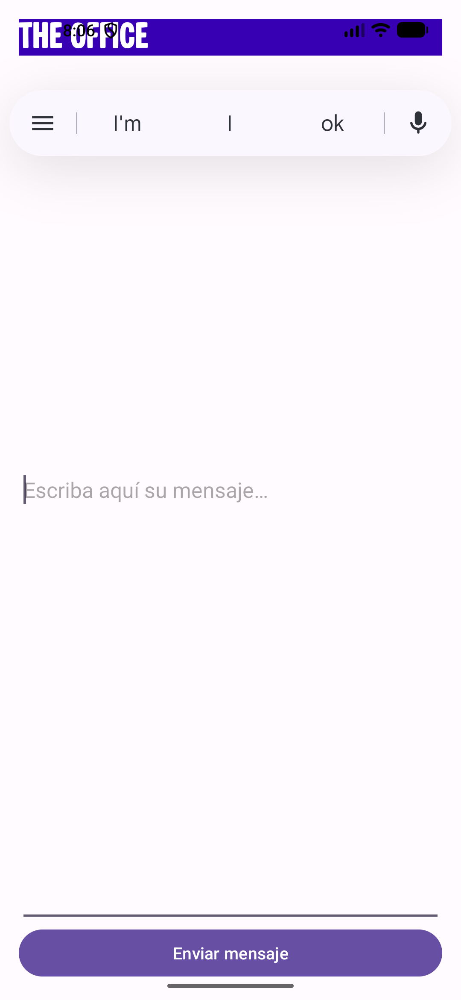
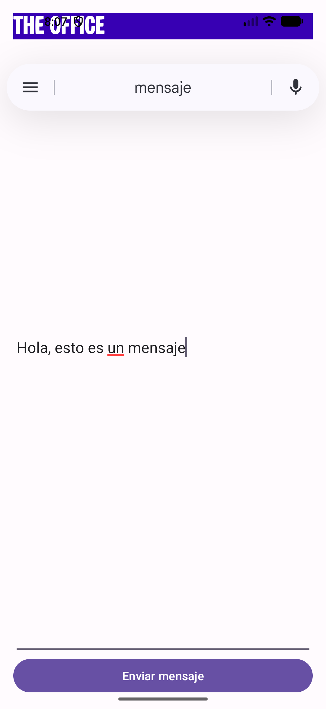
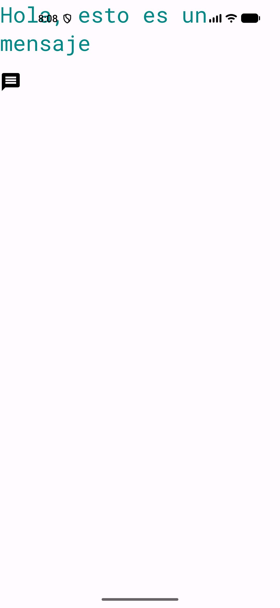
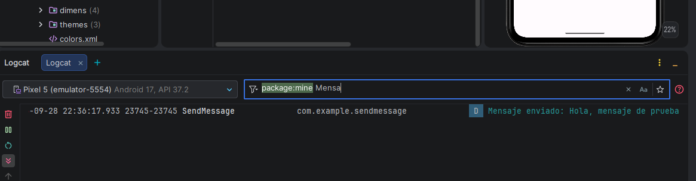
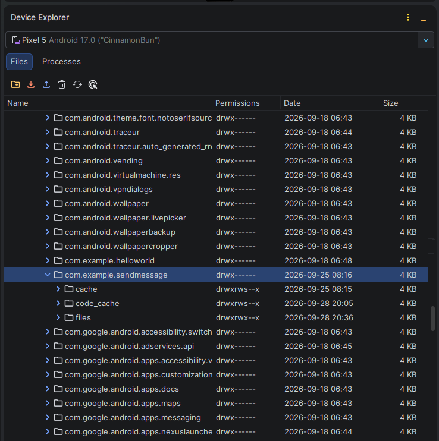

# SendMessage - Práctica Android (DAM)

Proyecto de aplicación Android desarrollado en **Kotlin** como parte del módulo de Desarrollo de Aplicaciones Multiplataforma (DAM). La aplicación implementa el envío de un mensaje de texto desde una actividad principal a una segunda actividad de visualización, utilizando **Intents explícitos** y almacenamiento de datos mediante **Bundle**.

---

## 1. Descripción del Proyecto

**SendMessage** es una aplicación móvil nativa cuyo objetivo es demostrar los conceptos fundamentales de la comunicación inter-actividades (*Inter-Activity Communication*) en el entorno de desarrollo Android. 

El flujo de trabajo de la aplicación es el siguiente:
1. El usuario introduce un mensaje en un campo de texto editable en la pantalla inicial (`SendMessageActivity`).
2. Al pulsar el botón de envío, la aplicación empaqueta el texto en una estructura de datos `Bundle` y lo adjunta a un `Intent`.
3. Se inicia la segunda actividad (`ViewMessageActivity`), la cual recupera el contenido del paquete y lo muestra en pantalla.
4. Se genera un registro de depuración en **Logcat** utilizando la etiqueta `SendMessage` para verificar la ejecución correcta.

---

## 2. Estructura del Proyecto

A continuación se detalla la estructura principal del código fuente y los recursos del proyecto:

```text
SendMessage/
├── app/
│   ├── src/
│   │   ├── main/
│   │   │   ├── java/com/example/sendmessage/
│   │   │   │   ├── SendMessageActivity.kt    # Actividad principal (redacción y envío)
│   │   │   │   ├── ViewMessageActivity.kt    # Actividad secundaria (recepción y muestra)
│   │   │   │   └── SendMessageApplication.kt # Clase Application personalizada
│   │   │   ├── res/
│   │   │   │   ├── drawable/
│   │   │   │   │   └── ic_message.xml        # Vector ejecutable de icono de mensaje
│   │   │   │   ├── font/
│   │   │   │   │   ├── barber_chop.otf       # Tipografía personalizada para el título principal
│   │   │   │   │   └── roboto_mono.xml       # Tipografía secundaria para la vista de mensaje
│   │   │   │   ├── layout/
│   │   │   │   │   ├── activity_send_message.xml # Layout de la pantalla principal
│   │   │   │   │   └── activity_view_message.xml # Layout de la pantalla de recepción
│   │   │   │   └── values/
│   │   │   │       ├── colors.xml            # Paleta de colores de la aplicación
│   │   │   │       ├── dimens.xml            # Centralización de dimensiones (dp y sp)
│   │   │   │       ├── strings.xml           # Centralización de cadenas de texto
│   │   │   │       └── themes.xml            # Configuración de temas e interfaz
│   │   │   └── AndroidManifest.xml           # Declaración de actividades y permisos
│   └── build.gradle.kts                      # Configuración Gradle del módulo app
└── build.gradle.kts                          # Configuración Gradle del proyecto raíz
```

---

## 3. Decisiones de Diseño

Para el desarrollo de la interfaz de usuario y la arquitectura de recursos se han aplicado las siguientes buenas prácticas del desarrollo Android:

* **Estructura de Layouts (`LinearLayout`)**:
  Se ha utilizado un contenedor vertical `LinearLayout` en ambas pantallas. En la pantalla principal, el campo de texto `EditText` utiliza `android:layout_height="0dp"` combinado con `android:layout_weight="1"` para ocupar el espacio vertical disponible de forma adaptable según la resolución del dispositivo.

* **Centralización de Recursos**:
  * **Textos (`strings.xml`)**: Todos los textos visibles e indicaciones (`hint`) están extraídos en recursos traducibles/centralizados para evitar valores fijos (*hardcoded*).
  * **Dimensiones (`dimens.xml`)**: Se han definido dimensiones para márgenes, anchos y altos de componentes.

* **Uso Correcto de Unidades de Medida (`dp` vs `sp`)**:
  * **`dp` (Density-independent Pixels)**: Utilizado para dimensionar elementos gráficos y márgenes (`ivMessageImage_width`, `ivMessageImage_height`, `ivMessageImage_marginBottom`, etc.), asegurando coherencia visual en pantallas con distinta densidad de píxeles.
  * **`sp` (Scale-independent Pixels)**: Utilizado exclusivamente para definir el tamaño de fuente (`tvTitle_textSize`, `tvSecondTitle_textSize`), respetando las preferencias de accesibilidad y escalado de texto configuradas por el usuario en el sistema operativo.

* **Tipografías Personalizadas**:
  Uso de fuentes específicas integradas en el directorio `res/font/` (`barber_chop` para el título de la vista principal y `roboto_mono` para la vista de recepción).

* **Ajuste del Teclado en el Manifiesto**:
  Uso de la propiedad `android:windowSoftInputMode="adjustResize"` en `AndroidManifest.xml` para evitar que el teclado virtual solape los elementos de la interfaz al escribir.

---

## 4. Funcionamiento de la Aplicación

El traspaso de información entre componentes se realiza mediante el patrón **Intent & Bundle**:

### Envío del mensaje (`SendMessageActivity.kt`)
```kotlin
val etSendMessage = findViewById<EditText>(R.id.etSendMessage)
val btSendMessage = findViewById<Button>(R.id.btSendMessage)

btSendMessage.setOnClickListener {
    val intent = Intent(this, ViewMessageActivity::class.java)
    val bundle = Bundle()
    bundle.putString("KEY_MESSAGE", etSendMessage.text.toString())
    intent.putExtras(bundle)

    Log.d("SendMessage", "Mensaje enviado: ${etSendMessage.text}")

    startActivity(intent)
}
```

### Recepción del mensaje (`ViewMessageActivity.kt`)
```kotlin
val tvSecondTitle = findViewById<TextView>(R.id.tvSecondTitle)

// Obtención del paquete (Bundle) proveniente del Intent
val bundle = intent.extras
val message = bundle?.getString("KEY_MESSAGE")

// Asignación del texto al componente de la interfaz
tvSecondTitle.text = message
```

---

## 5. Proceso de Depuración y uso de Logcat

Durante la ejecución, se utiliza la clase estándar `android.util.Log` para registrar eventos en la consola de depuración de Android Studio:

```kotlin
Log.d("SendMessage", "Mensaje enviado: ${etSendMessage.text}")
```

* **Etiqueta (Tag)**: `"SendMessage"`
* **Nivel de Log**: `DEBUG` (`Log.d`)

Para filtrar esta traza en Android Studio:
1. Abrir la pestaña **Logcat** en la parte inferior del IDE.
2. Aplicar el filtro de texto `tag:SendMessage` o seleccionar el nivel `Debug`.

---

## 6. Enlaces a Documentación Oficial

* [Intents y filtros de intents - Android Developers](https://developer.android.com/guide/components/intents-filters?hl=es-419)
* [Iniciar otra actividad y pasar datos - Android Developers](https://developer.android.com/training/basics/firstapp/starting-activity?hl=es-419)
* [Escribir e inspeccionar registros con Logcat - Android Developers](https://developer.android.com/studio/debug/logcat?hl=es-419)
* [Valores de recursos y dimensiones (dp vs sp) - Android Developers](https://developer.android.com/guide/topics/resources/more-resources?hl=es-419#Dimension)

---

## 7. Evidencias de Funcionamiento

> [!NOTE]
> *Inserta a continuación las capturas de pantalla solicitadas para la entrega de la práctica.*

### Captura 1: Pantalla inicial de la aplicación
*(Vista de `SendMessageActivity` al iniciar la app con el campo de texto y el botón de envío)*

```text
### Captura 1: Pantalla inicial de la aplicación


```

---

### Captura 2: Mensaje escrito
*(Vista de `SendMessageActivity` con el texto redactado por el usuario en el EditText)*

```text
### Captura 2: Mensaje escrito


```

---

### Captura 3: Mensaje recibido
*(Vista de `ViewMessageActivity` mostrando el mensaje enviado en el TextView)*

```text
### Captura 3: Mensaje recibido


```

---

### Captura 4: Logcat
*(Panel Logcat de Android Studio filtrado por `tag:SendMessage` mostrando el log de depuración)*

```text
### Captura 4: Logcat


```

---

### Captura 5: Device Explorer
*(Vista del panel Device Explorer de Android Studio mostrando la ruta interna del paquete `/data/data/com.example.sendmessage`)*

```text
### Captura 5: Device Explorer


```
